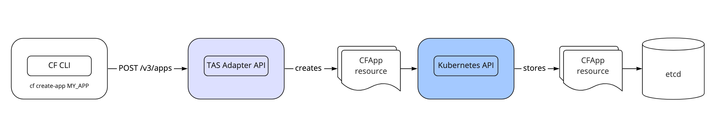
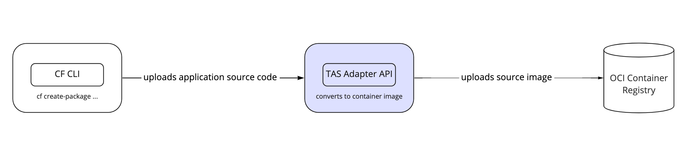
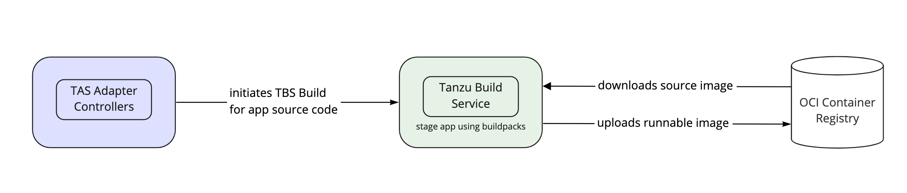

# Disaster recovery with Application Service Adapter

You have a number of options for disaster recovery with Application Service
Adapter. This page describes your disaster recovery options.

## Disaster recovery overview

You have a range of approaches for ensuring you can recover your Application Service Adapter deployment, apps, and data in case of a disaster. These approaches fall into two categories:

1. Backing up cluster and container image registry state and restoring from backups.
2. Re-creating the data in the deployment by automating the creation of state. This is achieved using scripted CI automation of the cf CLI and applying declarative Application Service Adapter resources to the cluster.

This topic focuses on the first approach by outlying where Application Service Adapter stores state and suggestions for backing up.

## State storage

In contrast to TAS for VMs, Application Service Adapter has no dedicated databases or blobstore. Instead, state is stored in two places:

1. As [Kubernetes custom resources](https://kubernetes.io/docs/concepts/extend-kubernetes/api-extension/custom-resources/) in the Kubernetes API. These custom resources are persisted in the cluster's [etcd](https://etcd.io/) datastore.
2. As container images in an OCI compatible registry, such as a self-hosted Harbor, DockerHub, or an IaaS provided registry.

To help illustrate this, consider the following scenarios.

### Application Service Adapter installation resources

TAS operators are familiar with backing up their Ops Manager and BOSH Director databases to safeguard their installation configuration. For Application Service Adapter this works differently. Application Service Adapter is installed using the `tanzu package install` command. This causes the creation of a variety of [Carvel](https://carvel.dev/) package installation resources and `ConfigMaps` on the cluster which are managed by `kapp-controller`. These installation resources are stored in the Kubernetes API as custom resources which are ultimately stored in etcd.

### Application Service Adapter Cloud Foundry API resources

TAS for VMs stores CF API state and application configuration across a number of databases, with the majority of it held within the Cloud Controller API's CCDB database. Application Service Adapter does not maintain its own datastore for this purpose, but instead represents all Cloud Foundry resources as Kubernetes custom resources. These custom resources are managed by the Kubernetes API and stored in etcd.

### Application source code

Application Service Adapter converts application source code into single-layer OCI images which are stored in the registry specified at installation.

### Runnable application artifacts

TAS for VMs operators can be familiar with the concept of droplets, or TAR files representing staged apps that are ready to run on the platform. Application Service Adapter, using Tanzu Build Service, produces runnable container images instead of TAS-style droplets which are stored in the registry specified at installation.

## Backup and restore

VMware recommends that operators take frequent backups of both the Kubernetes cluster's etcd and the registry using open source tools such as [Velero](https://velero.io/) or the native backup function provided by their infrastructure platform.
