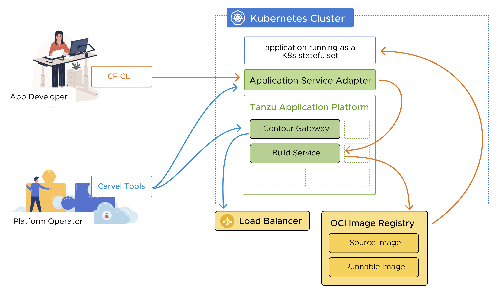

# Application Service Adapter for VMware Tanzu Application Platform

Application Service Adapter provides compatibility with CF client
interfaces while running on top of K8s and integrating with Tanzu Application
Platform. Learn more in this topic.

With Application Service Adapter, development teams using Tanzu Application Service for VMs tooling, such as the Cloud Foundry command-line interface (cf CLI) and other clients of the Cloud Foundry API (CAPI), can maintain their familiar workflows while their platform teams transition their infrastructure and deployments to Kubernetes.

For more information, see:

- [Cloud Foundry](https://www.cloudfoundry.org/)
- [Tanzu Application Service for VMs](https://tanzu.vmware.com/application-service)
- [Tanzu Application Platform](https://tanzu.vmware.com/application-platform)

## Application Service Adapter Overview

The following diagram shows a high-level architecture of Application Service Adapter with user flows:

Application Service Adapter is distributed as a [Carvel package](https://carvel.dev/) for platform teams to configure and install to a Kubernetes cluster with the Tanzu CLI tool. The key user personas of Application Service Adapter remain the same as the user personas of Tanzu Application Serivce: the platform operator and the app developer.

Platform teams create Cloud Foundry orgs and spaces in the installation, which the Application Service Adapter backs with separate Kubernetes namespaces. Application developers then use these orgs and spaces to organize their apps as they do today with Tanzu Application Service for VMs.

Application developers log in to their Application Service Adapter installation with credentials for the underlying Kubernetes cluster, but then use the cf CLI and CAPI to push apps and to map routes to them.

Application Service Adapter integrates with an existing installation of [Tanzu Build Service](https://tanzu.vmware.com/build-service) component of Tanzu Application Platform to build container images for app code deployed to the platform. It also integrates with [Contour](https://projectcontour.io/) to realize ingress routes to running apps.

To learn about Kubernetes cluster requirements and to plan your installation, see [Reference architecture](reference-architecture.md).

To install Application Service Adapter and its dependencies, go to [Installing prerequisites](install-prerequisites.md).

##  Notice of telemetry collection for Application Service Adapter

[//]: # (This following text came from legal. Do not edit it.)

Application Service Adapter for VMware Tanzu Application Platform participates in the VMware Customer Experience Improvement Program (CEIP).
As part of CEIP, VMware collects technical information about your organization’s use of VMware
products and services in association with your organization’s VMware license keys.
For information about CEIP, see the [Trust & Assurance Center](https://www.vmware.com/solutions/trustvmware/ceip.html).
You may join or leave CEIP at any time.
The CEIP Standard Participation Level provides VMware with information to improve its products and
services, identify and fix problems, and advise you on how to best deploy and use VMware products.
For example, this information can enable a proactive product deployment discussion with your VMware
account team or VMware support team to help resolve your issues.
This information cannot directly identify any individual.

[//]: # (The text above came from legal. Do not edit it.)

You must acknowledge that you have read the VMware CEIP policy before you can proceed with the
installation.
For more information, see [Configure the installation settings](install.md#configure-installation-settings) in _Installing Application Service Adapter_.
To opt out of telemetry participation after installation, see
[Opting out of telemetry reporting](install.md#opt-out-telemetry) in _Installing Application Service Adapter_.
