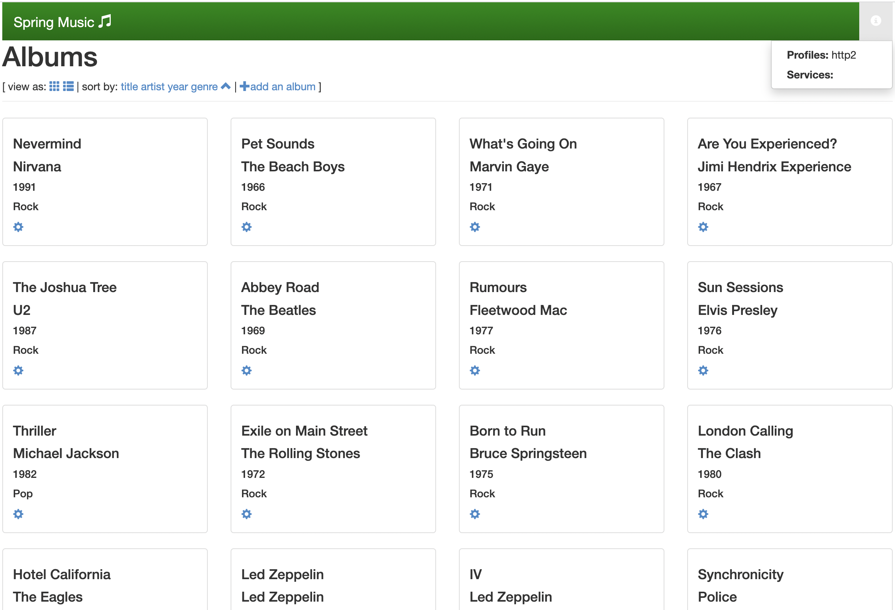
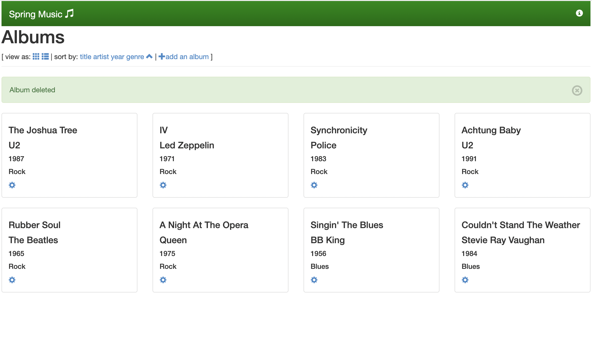
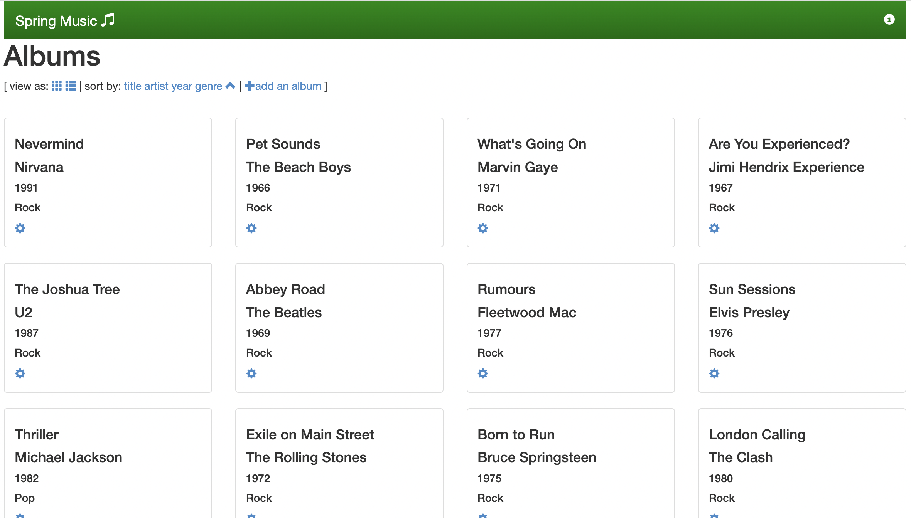
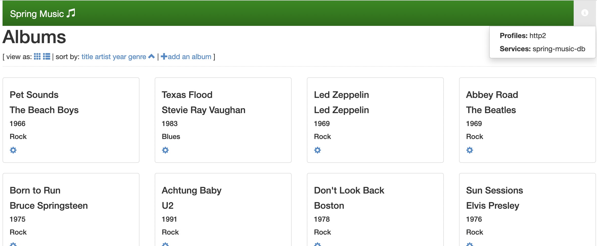
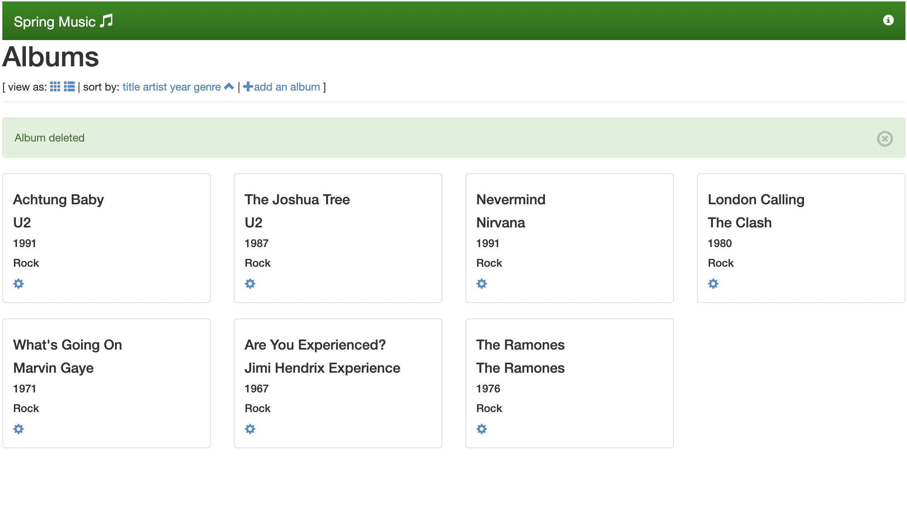

# Use Application Service Adapter to push the spring-music app

This how-to uses Application Service Adapter to push the
spring-music app and bind it to a MySQL-compatible database represented as a CF service
instance.

See [spring-music sample Java application](https://github.com/cloudfoundry-samples/spring-music).

## Prerequisites

You must have a Java version between 8 and 17 installed to your local workstation.

## Clone and prepare the application locally

1. From the command line, clone the spring-music sample application Git repository to a directory on your local workstation:

    ```bash
    git clone https://github.com/cloudfoundry-samples/spring-music
    ```

1. Change into the root directory of the cloned repository:

    ```bash
    cd spring-music
    ```

1. Build a runnable Spring Boot JAR file for the application:

    ```
    ./gradlew clean assemble
    ```

## Push the app without persistent storage

Ensure you are logged into the Application Service Adapter environment you intend to use and that you have targeted the desired Cloud Foundry org and space. You can use `cf target` to verify this context.

1. Use the cf CLI to push the application to your Application Service Adapter environment:

    ```
    cf push
    ```

    You should see output similar to the following:

    ```
    Pushing app spring-music to org o / space s as cf-admin...
    Applying manifest file /Users/tanzu/workspace/spring-music/manifest.yml...

    Updating with these attributes...
      applications:
      - name: spring-music
        path: /Users/tanzu/workspace/spring-music/build/libs/spring-music-1.0.jar
        memory: 1G
        random-route: true
        env:
          JBP_CONFIG_SPRING_AUTO_RECONFIGURATION: '{enabled: false}'
          SPRING_PROFILES_ACTIVE: http2
    Manifest applied
    Packaging files to upload...
    Uploading files...
     52.64 MiB / 52.64 MiB [==========================================] 100.00% 31s

    Waiting for API to complete processing files...

    Staging app and tracing logs...

       Build reason(s): CONFIG
    ...

    Waiting for app spring-music to start...

    Instances starting...

    name:              spring-music
    requested state:   started
    routes:            spring-music-stellar-sitatunga-cz.apps.example.com
    last uploaded:     Tue 08 Nov 16:24:36 PST 2022
    stack:             io.buildpacks.stacks.bionic
    buildpacks:

    type:            web
    sidecars:
    instances:       1/1
    memory usage:    1024M
    start command:   java "org.springframework.boot.loader.JarLauncher"
         state     since                  cpu    memory   disk     logging      details
    #0   running   2022-11-09T00:25:33Z   0.0%   0 of 0   0 of 0   0/s of 0/s

    type:            executable-jar
    sidecars:
    instances:       0/0
    memory usage:    1024M
    start command:   java "org.springframework.boot.loader.JarLauncher"
    There are no running instances of this process.

    type:            task
    sidecars:
    instances:       0/0
    memory usage:    1024M
    start command:   java "org.springframework.boot.loader.JarLauncher"
    There are no running instances of this process.
    ```

1. The manifest for the spring-music application assigns it a random route by default, which is present in the `routes` field of the `cf push` output. Navigate to the route URL in your browser and verify that it serves requests correctly. You should see a webpage similar to the following:

    

1. Make a few changes to the music catalog: use the gear icon on each entry to modify or delete some of the albums, and use the "add an album" link at the top of the page to add some albums.

    

1. Restart the spring-music application:

    ```bash
    cf restart spring-music
    ```

    The application will be unavailable for a short period of time while it restarts.

1. After it has finished restarting, refresh your browser window and observe that your modifications have not been preserved.

    


## Create a database service for persistent storage

> **Caution** The following instructions provide an easy way to create a MySQL database on the same Kubernetes cluster as the Application Service Adapter installation, but this database deployment is not suitable for production use. If you require a production-grade database on Kubernetes, consider using [VMware Tanzu SQL with MySQL for Kubernetes](https://docs.vmware.com/en/VMware-Tanzu-SQL-with-MySQL-for-Kubernetes/1.2/tanzu-mysql-k8s/GUID-index.html) or [VMware Tanzu SQL with Postgres for Kubernetes](https://docs.vmware.com/en/VMware-Tanzu-SQL-with-Postgres-for-Kubernetes/index.html).

1. Create a separate namespace to run a containerized MySQL database:

    ```bash
    kubectl create namespace service-instances
    ```

1. Create a Kubernetes Deployment of a MySQL-compatible database in this namespace, along with a Kubernetes Service that exposes it inside the cluster and a Kubernetes Secret with credentials:

    ```bash
    kubectl apply -n service-instances -f - <<EOF
    ---
    apiVersion: v1
    kind: Secret
    metadata:
      name: spring-music-db
    type: servicebinding.io/mysql
    stringData:
      type: mysql
      provider: mariadb
      host: spring-music-db.service-instances.svc
      port: "3306"
      database: default
      # demo credentials
      username: user
      password: pass

    ---
    apiVersion: v1
    kind: Service
    metadata:
      name: spring-music-db
    spec:
      ports:
      - port: 3306
      selector:
        app: spring-music-db

    ---
    apiVersion: apps/v1
    kind: Deployment
    metadata:
      name: spring-music-db
      labels:
        app: spring-music-db
    spec:
      selector:
        matchLabels:
          app: spring-music-db
      template:
        metadata:
          labels:
            app: spring-music-db
        spec:
          # no persistance configured, the database will be reset when the pod terminates
          containers:
          - image: mariadb:10.5
            name: mysql
            env:
            - name: MYSQL_USER
              valueFrom:
                secretKeyRef:
                  name: spring-music-db
                  key: username
            - name: MYSQL_PASSWORD
              valueFrom:
                secretKeyRef:
                  name: spring-music-db
                  key: password
            - name: MYSQL_DATABASE
              valueFrom:
                secretKeyRef:
                  name: spring-music-db
                  key: database
            - name: MYSQL_ROOT_PASSWORD
              value: root
            ports:
            - containerPort: 3306
              name: mysql
            livenessProbe:
              tcpSocket:
                port: mysql
            readinessProbe:
              tcpSocket:
                port: mysql
            startupProbe:
              tcpSocket:
                port: mysql
    EOF
    ```

1. Verify that the Deployment for the database is ready:

    ```bash
    kubectl get deploy -n service-instances spring-music-db
    ```

    You should see output similar to the following:

    ```
    NAME              READY   UP-TO-DATE   AVAILABLE   AGE
    spring-music-db   1/1     1            1           4m
    ```

    If the `READY` column does not display `1/1`, wait a few moments and inspect the Deployment again.

## Bind the database to the application

1. Create a user-provided service instance in the Cloud Foundry space containing the JSON-formatted contents of the `spring-music-db` Secret:

    ```bash
    MYSQL_CRED_JSON=$(kubectl -n service-instances get secret spring-music-db -ojson | jq '.data | map_values(@base64d)')
    cf create-user-provided-service spring-music-db -p "$MYSQL_CRED_JSON"
    ```

1. Bind the service instance to the spring-music application:

    ```bash
    cf bind-service spring-music spring-music-db
    ```

1. Restage the application:

    ```bash
    cf restage spring-music
    ```

1. After the application finishes restaging and restarting, refresh the browser window with the spring-music application and click on the app information icon in the upper right corner. It should indicate that the application is bound to the spring-music-db service:

    

1. Make modifications to the album catalog again:

    

1. Restart the spring-music application again:

    ```bash
    cf restart spring-music
    ```

1. Refresh the browser window and observe that the changes you made now persist through application restarts.
