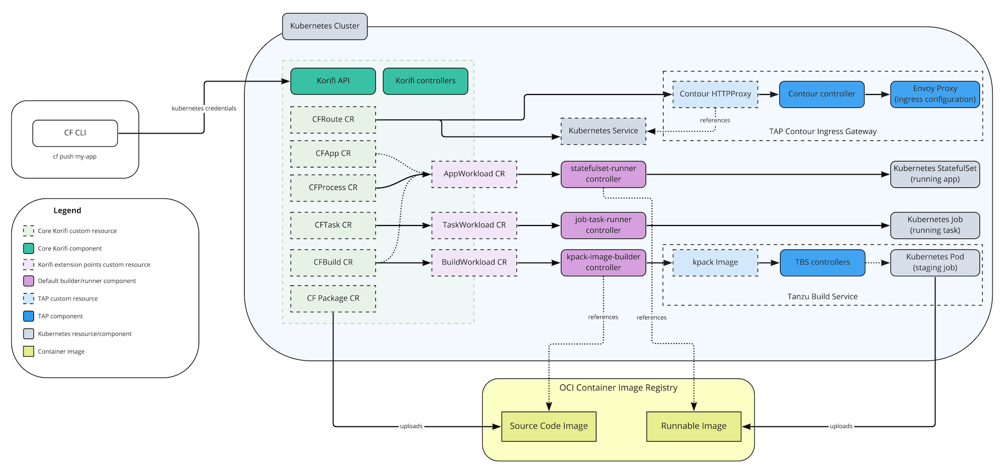
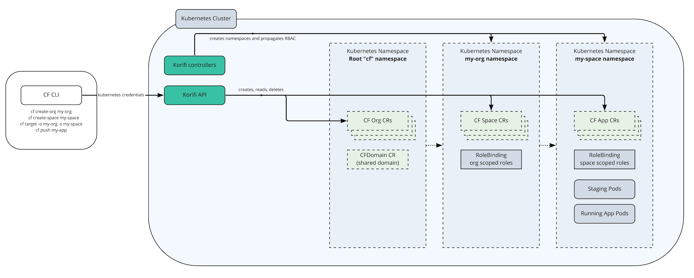
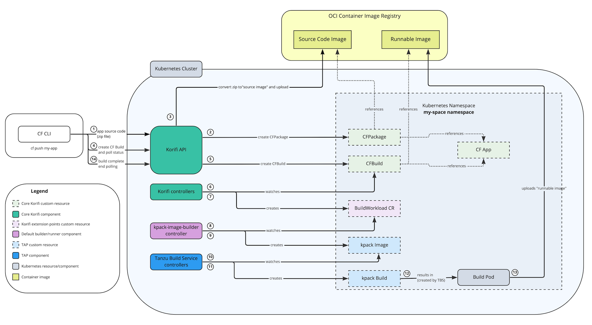
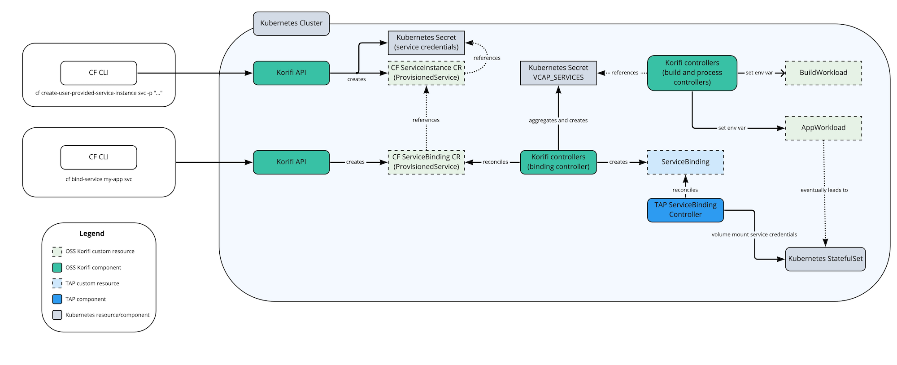
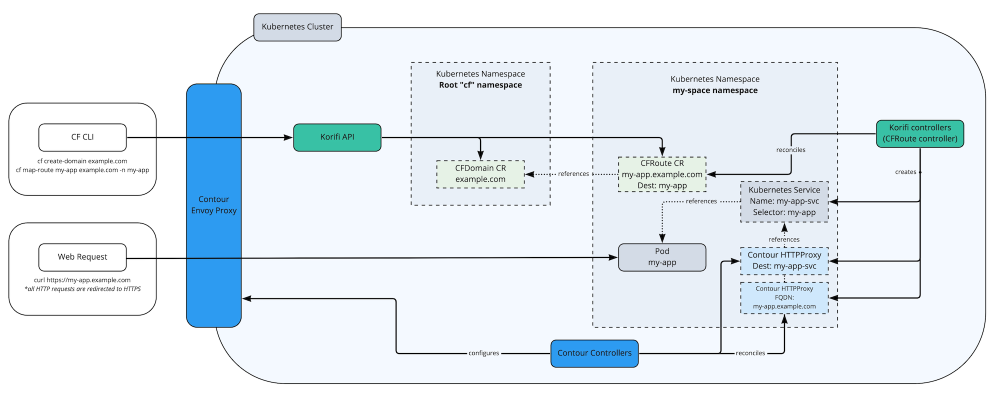
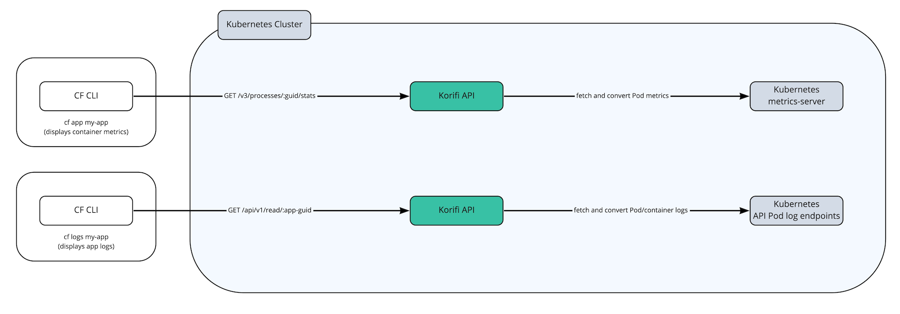

# Architecture

This document describes the technical architecture of Application Service Adapter and its subsystems.

* [Overview](#overview)
* [High-level architecture](#high-level-architecture)
* [Experimental Cartographer integration](#cartographer-integration)
* [Authentication and authorization](#authentication-authorization)
* [Organization and Space management](#org-space-management)
* [Building (staging) applications](#building-and-staging-applications)
* [Services](#services)
* [Routing](#routing)
* [App Logging and Metrics](#app-logs-metrics)

## Overview
Application Service Adapter implements a subset of the [v3 Cloud Foundry APIs](https://v3-apidocs.cloudfoundry.org/) in order to support common Cloud Foundry developer workflows. Application Service Adapter is installed directly onto a Kubernetes cluster than has Tanzu Application Platform (TAP) installed and provides a CF API translation layer that converts CF API calls into underlying and Kubernetes resources. In addition to this API, Application Service Adapter also provides a set of Kubernetes [custom resources](https://kubernetes.io/docs/concepts/extend-kubernetes/api-extension/custom-resources/), [controllers](https://kubernetes.io/docs/concepts/architecture/controller/), and [admission webhooks](https://kubernetes.io/docs/reference/access-authn-authz/extensible-admission-controllers/).

## High-level architecture

### Components
Application Service Adapter includes components from the open source Cloud Foundry Korifi project as well as a number of proprietary components for deeper integration with Tanzu Application Platform.

The Korifi components are primarily tasked with implementing the Cloud Foundry data model and APIs. They are:

* **Korifi CRDs:** A set of Kubernetes custom resources under the korifi.cloudfoundry.org API Group that implement the core V3 Cloud Foundry resources. These custom resources replicate the Cloud Foundry data model and are used to store persistent state for the CF API translation layer. These resources serve as an extension point for further interoperability and are accessible directly to Kubernetes users via existing Kubernetes tooling (e.g. the kubectl CLI).
* **Korifi API Deployment:** A Golang implementation of a core set of V3 Cloud Foundry APIs that is backed by the Korifi CRDs. Existing Cloud Foundry API clients (such as the cf CLI) can target the Korifi API and continue to use their existing CF developer workflows.
* **Korifi Controllers Deployment:** A set of Kubernetes controllers that implement CF subsystems by orchestrating and reconciling the Korifi CRDs into consolidated intermediate resources that contain the information necessary to build and run an application. This deployment also runs admission webhooks that validate and normalize Korifi resources.

Application Service Adapter converts these intermediate resources using its default builder/runner controller implementations into TAP and Kubernetes resources such as Tanzu Build Service (kpack) Images for building applications and Kubernetes StatefulSets for running them. These intermediate resources and default implementations are:

* **BuildWorkload Resource**: A custom resource that serves as an interface to the underlying build system used for staging applications. This resource contains all the information needed to stage an app and controller implementations communicate back via its status. The `kpack-image-builder` component is the default implementation for application staging that uses [Tanzu Build Service](https://tanzu.vmware.com/build-service) and [Tanzu Buildpacks](https://docs.vmware.com/en/VMware-Tanzu-Buildpacks/index.html). When the experimental Cartographer integration is activated this resource is reconciled by the `cartographer-builder-runner` component. For more details on the application building process view the [build (staging) applications](#building-and-staging-applications) section below.
* **AppWorkload Resource**: A custom resource that serves as an interface to the underlying runtime. This resource contains all the information needed to run an app, and controller implementations communicate back via its status. The `statefulset-runner` component is the default implementation that runs apps using Kubernetes `StatefulSets`. `StatefulSets` allow Application Service Adapter to support Cloud Foundry features such as the `CF_INSTANCE_INDEX` (an ordered numeric index for each container) environment variable and APIs. When the experimental Cartographer integration is activated this resource is reconciled by the `cartographer-builder-runner` component.
* **TaskWorkload Resource**: A custom resource that serves as an interface to the underlying runtime. This resource contains all the information needed to run a Cloud Foundry task, and controller implementations communicate back via its status. The `job-task-runner` component is the default implementation that runs tasks via Kubernetes `Jobs`.

## Experimental Cartographer integration

Application Service Adapter includes an (optional) experimental builder and runner implementation (`cartographer-builder-runner`) that utilizes TAP's Cartographer Supply Chains to manage the build and run stages of the application lifecycle.

## Authentication and authorization

Application Service Adapter does not include its own user management or permission system and instead uses the user's Kubernetes credentials to interact directly with the Kubernetes API. Cloud Foundry roles are implemented using [Kubernetes RBAC resources](https://kubernetes.io/docs/reference/access-authn-authz/rbac/) and users can be assigned to these roles using the existing cf CLI role assignment commands. Internally this is represented as namespace-scoped `RoleBindings` to `ClusterRoles` that represent common CF roles such as `SpaceDeveloper`.

For more details, see the dedicated [User Authentication Overview] docs.

## Organization and Space management

Cloud Foundry has a tiered tenancy system consisting of the cluster or "foundation" level, organization level, and space level. A Cloud Foundry installation will contain one or more organizations which will themselves contain one or more spaces. CF roles typically allow for read/write access in these various areas. For example, a "CF Admin" user can make shared domains for the entire CF installation as well as interact with apps within an individual space, while a "Space Developer" user will typically be able to view certain resources within their org as well as push apps within their assigned space.

Application Service Adapter models CF organizations and spaces using Kubernetes Namespaces. There is a root "cf" namespace that can contain multiple `CFOrg` custom resources. These initiate the creation of namespaces for each org which themselves will contain `CFSpace` resources that point to additional namespaces for each space. This maps closely to the CF tenancy model in terms of app isolation and user permissions on Kubernetes. All organization-scoped CF resources live within the corresponding "organization namespace" and space-scoped CF resources (apps, routes, builds, etc.) live within the relevant "space namespace." Kubernetes RBAC resources are made in the each namespace to control access. For example, an Org Manager has a `RoleBinding`  to the "OrgManager" `ClusterRole` in each namespace they manage. Likewise, Space Developers have a `RoleBinding`  to the "SpaceDeveloper" `ClusterRole` in the space namespaces.

## Building (staging) applications

Application Service Adapter uses [Tanzu Build Service](https://tanzu.vmware.com/build-service) and [Tanzu Buildpacks](https://docs.vmware.com/en/VMware-Tanzu-Buildpacks/index.html) to build applications.

Application source code is packaged and transmitted by CF clients to the Korifi API where it is converted into a single-layer container image, or "source image", that can be used by Tanzu Build Service. When CF clients create a Cloud Foundry Build through the Korifi API this is translated into a "BuildWorkload" custom resource by Korifi. By default, Application Service Adapter will use its `kpack-image-builder` controller to translate this "BuildWorkload" directly into Tanzu Build Service resources and a "build Pod" will be scheduled to build the app using Tanzu Buildpacks. Tanzu Buildpacks are [Cloud Native Buildpacks](https://buildpacks.io/) and can be thought of as an evolution of the [Cloud Foundry buildpacks](https://docs.cloudfoundry.org/buildpacks/) that Cloud Foundry operators may be familiar with. They differ mainly in that there are a few [configuration differences](buildpack-differences.md) and that they produce OCI container images instead of Cloud Foundry droplets.

### Note on Blobstores
Operators of Tanzu Application Service may be familiar with the platform's "blobstore" or object storage for application source code and staged droplets. Application Service Adapter does not rely on a blobstore and instead uses the image registry that is configured at installation time for storing source code and runnable app images.

## Services

Application Service Adapter has support for [user-provided service instances](https://docs.cloudfoundry.org/devguide/services/user-provided.html) through the CFServiceInstance and CFServiceBinding custom resources. These resources primarily exist to power the CF APIs and store additional state that isn't relevant downstream. They also implement the `ProvisionedService` "duck type" from the [Service Binding for Kubernetes specification](https://servicebinding.io/) which allow them to interoperate directly with other projects in the service bindings ecosystem (e.g. kpack, ServiceBinding reconcilers, etc.).

Application developers can provide service credentials through user-provided service instances and Application Service Adapter will store them in Kubernetes `Secrets`. It then aggregates them into a single "VCAP_SERVICES" secret that is provided to app containers as the [VCAP_SERVICES environment variable](https://docs.cloudfoundry.org/devguide/deploy-apps/environment-variable.html#VCAP-SERVICES) to maintain compatibility with existing Cloud Foundry-aware applications and frameworks.

Additionally, Application Service Adapter integrates with the TAP Service Bindings reconciler through the [ServiceBinding](https://servicebinding.io/spec/core/1.0.0/#service-binding) resource to volume mount these credentials on to workload Pods. This enables apps to use updated frameworks, such as [Spring Cloud Bindings](https://github.com/spring-cloud/spring-cloud-bindings), that are aware of this form of credential projection.

## Routing

Application Service Adapter uses the Tanzu Application Platform installation's Contour to implement ingress routing for both the Korifi API and app workloads. The `CFRoute` custom resource backs the relevant Cloud Foundry route management APIs and is converted by the Korifi Controllers component into Contour `HTTPProxy` and Kubernetes `Service` resources. A validating admission webhook applies validation rules to the routes (e.g. no duplicate routes, route has a valid `CFDomain`, etc).

## App Logging and Metrics

Application Service Adapter supports best-effort access to the latest logs and metrics for apps through the "cf app", "cf logs", and "cf push" cf CLI commands. The Korifi API implements the relevant Cloud Foundry APIs for querying these resources and translates the request into requests to the [Kubernetes metrics-server](https://github.com/kubernetes-sigs/metrics-server) (for Pod cpu/memory metrics) and the [Kubernetes Pod log API](https://kubernetes.io/docs/reference/generated/kubernetes-api/v1.24/#read-log-pod-v1-core) (application/staging logs).

For longer term storage and more reliable access to logs and metrics, we suggest following [these recommendations around app observability](https://tanzu.vmware.com/developer/guides/app-observability/) and exporting logs and metrics to an external service such as [VMware Aria Operations for Applications](https://tanzu.vmware.com/aria-operations-for-applications).
